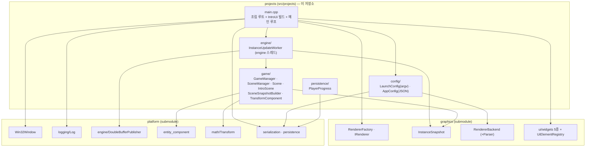
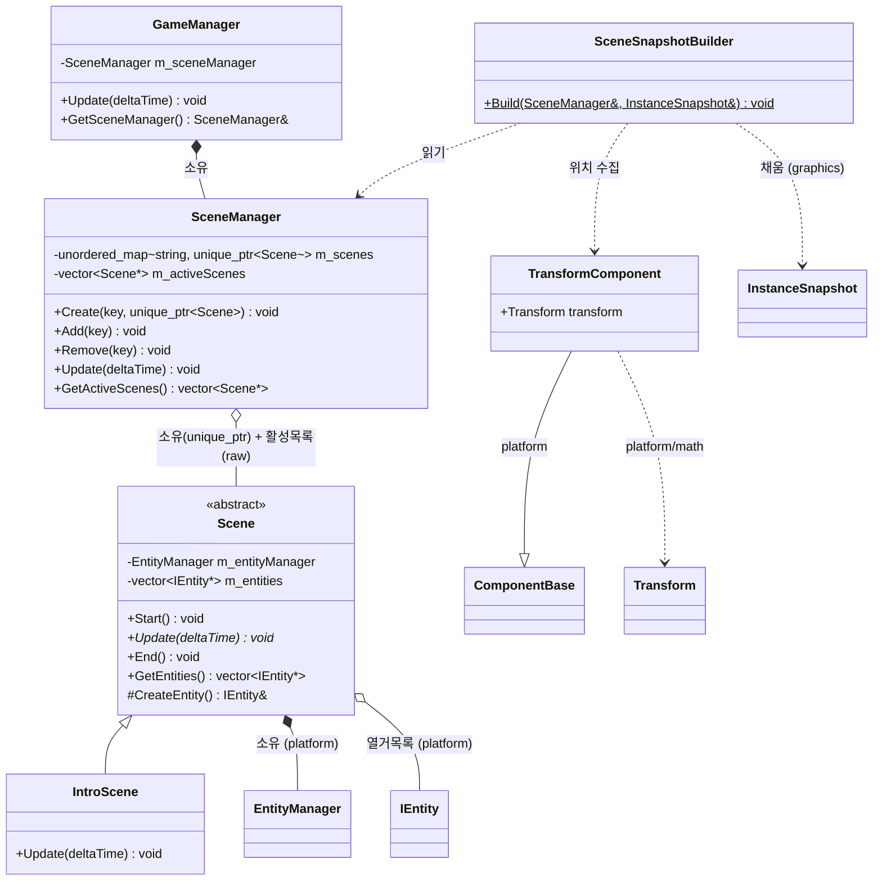
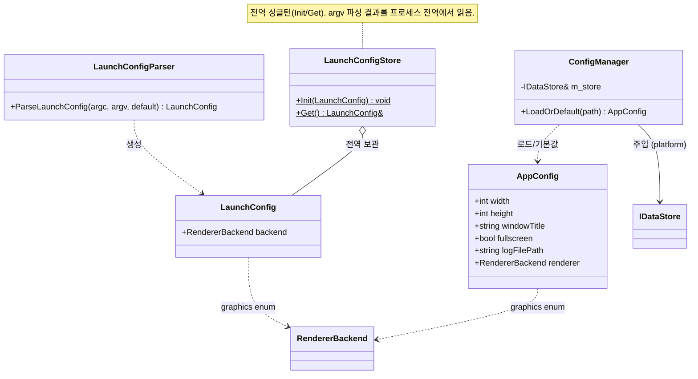
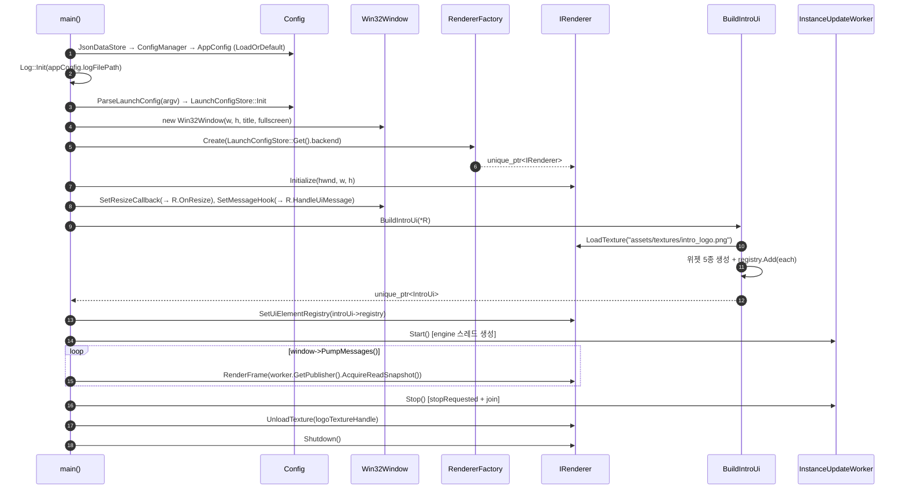
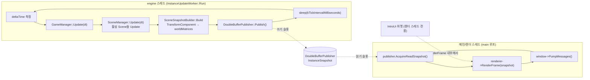
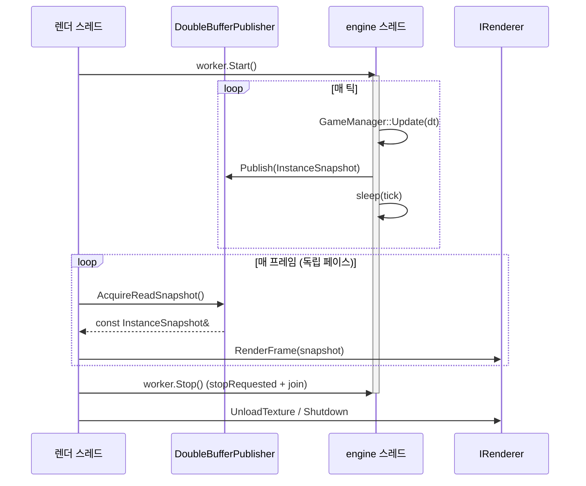

# 전체아키텍처 다이어그램 — World-of-Tank-imitation-Refactoring (projects) (2026-08-31 02:12)

`agent_harness/.claude/commands/diagram_delegation.md` 워크플로우로 생성한 첫 스냅샷.
이 문서는 영구 보관하며, 다음 실행은 이 파일을 덮어쓰지 않고 새 날짜 파일을 추가한다.
`platform` / `graphics` 저장소의 같은 날짜 스냅샷과 함께 읽으면 3계층 전체가 이어진다.

---

## Step 1 — 범위와 표현 계획

- 대상 범위: **전체 시스템** (`src/projects` + 그것이 소비하는 `graphics` / `platform` 경계).
- 뷰 집합: 표준 4개 뷰 전부.
- 뷰별 아트 티어:
  - 뷰 1 (모듈 맵): Mermaid flowchart.
  - 뷰 2 (클래스 & 연관도): Mermaid classDiagram.
  - 뷰 3 (생명주기 & 소유권): Mermaid sequenceDiagram(조립) + stateDiagram(씬/워커).
  - 뷰 4 (런타임 / 스레드 / 데이터플로우): Mermaid sequenceDiagram + flowchart — **이 저장소에서 가장 내용이 많은 뷰**.
- 에스컬레이션: 전 뷰 Mermaid. 최대 노드 약 20개. HTML 불필요.

`projects`는 `platform`과 `graphics`를 모두 사용해 WOT의 실제 동작을 구현하는 최하위 계층이다.
`platform`/`graphics`는 이 저장소를 몰라야 한다(역방향 금지).

---

## 뷰 1 — 시스템 / 모듈 맵

### 모델 목록

| 모듈 (`src/projects/`) | 주요 타입 | 소비하는 graphics | 소비하는 platform |
|---|---|---|---|
| `main.cpp` | `main()`, `IntroUi`(struct), `BuildIntroUi()` | RendererFactory, IRenderer, ui/widgets 5종, UiElementRegistry | Win32Window, logging/Log, serialization/JsonDataStore |
| `config/` | LaunchConfig, LaunchConfigParser, LaunchConfigStore, AppConfig, ConfigManager, ConfigFields | renderer/RendererBackend(+Parser) | serialization/IDataStore, DataRecordAccess |
| `engine/` | InstanceUpdateWorker | renderer/InstanceSnapshot | engine/DoubleBufferPublisher, IFrameDataPublisher |
| `game/` | GameManager, SceneManager, Scene(추상), IntroScene, SceneSnapshotBuilder, TransformComponent | renderer/InstanceSnapshot | entity_component/{EntityManager, IEntity, ComponentBase}, math/Transform |
| `persistence/` | PlayerProgress | (없음) | persistence/ISaveable, serialization/DataRecordAccess |

- 의존 방향: `projects → graphics → platform` 단방향. `projects` 안에서는 `main → {config, engine, game}`, `engine → game`.
- `game`은 `graphics`에서 `InstanceSnapshot`(프레임 데이터 계약)만 알고 렌더러 구현은 모른다.
- `config`의 `AppConfig`/`LaunchConfig`가 `graphics`의 `RendererBackend` enum을 참조하는 것이 유일한 "설정 → graphics" 방향 결합.

### 다이어그램



---

## 뷰 2 — 서브시스템 클래스 & 연관도

### 2-a. `game/` — 씬 전환·생명주기 뼈대



### 2-b. `config/` — 두 갈래 설정



---

## 뷰 3 — 객체 생명주기 & 소유권

### 3-a. `main()` 조립 루트 순서



### 3-b. Scene / InstanceUpdateWorker 수명주기

```mermaid
stateDiagram-v2
    state "Scene" as S {
        [*] --> Registered : SceneManager::Create(key, scene)
        Registered --> Active : SceneManager::Add(key) → Start()
        Active --> Active : Update(dt) 매 틱
        Active --> Registered : SceneManager::Remove(key) → End()
        Registered --> [*]
        note right of Active : Entity 생성 경로(CreateEntity)만 있고 제거 경로 없음 — DEFERRED
    }
    state "InstanceUpdateWorker" as W {
        [*] --> Idle
        Idle --> Running : Start() → std::thread(Run)
        Running --> Running : Run 루프 (tick + sleep)
        Running --> Idle : Stop() → stopRequested + join
        Idle --> [*] : ~InstanceUpdateWorker (방어적 Stop)
    }
```

### 소유권 요약

```
main() (지역변수)
 ├─ unique_ptr<Win32Window>
 ├─ unique_ptr<IRenderer>          → 내부에서 ImGuiManagerDX{N} 소유 (graphics)
 ├─ unique_ptr<IntroUi>            → UiElementRegistry + 위젯 5종을 값 멤버로 소유
 │                                   (registry는 위젯 주소를 비소유 참조 → IntroUi는 이동/복사 금지)
 └─ InstanceUpdateWorker (지역)
     ├─ DoubleBufferPublisher<InstanceSnapshot>   (platform seam)
     ├─ std::thread
     └─ Run() 내부 지역변수: GameManager
                              └─ SceneManager
                                  └─ unique_ptr<Scene>[] (IntroScene 등)
                                      └─ EntityManager → Entity[] → IComponent[]
```

- `GameManager`는 워커 스레드 `Run()`의 **지역 변수**다 — 스레드 수명 동안 1회만 생성/파괴.
- `IntroUi`의 위젯과 `registry`는 서로 주소를 참조하므로 항상 `unique_ptr<IntroUi>`로만 다룬다(값 복사 시 댕글링).

---

## 뷰 4 — 런타임 / 스레드 / 데이터플로우

### 모델 목록

- **스레드 2개**:
  - **메인/렌더 스레드** — `main()`의 `while (window->PumpMessages())` 루프. `renderer->RenderFrame()` 호출. `IntroUi` 위젯도 이 스레드에 산다.
  - **engine 스레드** — `InstanceUpdateWorker::Run()`. 루프: `now` 측정 → `deltaTime` = 벽시계 차이 → `gameManager.Update(dt)` → `SceneSnapshotBuilder::Build(sceneManager, snapshot)` → `m_publisher.Publish()` → `sleep_for(kTickIntervalMilliseconds)`.
- **스레드 간 seam**: `DoubleBufferPublisher<InstanceSnapshot>` (platform).
  - engine 스레드: `Publish()` (쓰기 슬롯 커밋).
  - 렌더 스레드: `AcquireReadSnapshot()` (읽기 슬롯).
  - 슬롯 분리가 동기화를 책임진다 — `main.cpp`/`IRenderer`는 동기화 정책을 모른다.
- **더블버퍼를 타지 않는 데이터**: UI 위젯. 3D `InstanceSnapshot`과 달리 위젯엔 안전한 스레드 간 전달 장치가 없어, 위젯은 렌더 스레드 전용이고 engine 스레드가 건드리지 않는다(main.cpp 주석 명시).

### 다이어그램 — 한 프레임의 데이터 흐름



### 시퀀스 — 종료 순서 포함



- engine 틱 레이트와 렌더 프레임 레이트는 **독립**이다 — 같은 스냅샷을 두 번 읽거나 건너뛸 수 있다.
- `deltaTime`이 벽시계 기준이라 시뮬레이션 속도는 틱 지터에 자동 보정되지만, 프레임-틱 페이싱 계약은 없다.

---

## Step 3 — 다이어그램 기준 아키텍처 점검

### 일치성 검사

- 첫 스냅샷이라 직전 문서 diff 없음.
- **[드리프트 발견] `docs/architecture/게임로직_구조_현황.md`가 코드와 어긋난다.**
  - 그 문서는 `PrototypeScene`("원본 `TestScene`을 대체")을 현재 구조로 서술한다.
  - 실제 코드에는 `PrototypeScene`이 없고 `IntroScene`이 있다 — `GameManager.cpp`가 `IntroScene.h`를 include하고 등록한다.
  - `게임_기본기능_채우기_20260819` 사이클에서 바뀐 것으로 보이나, 영구 참조 문서에 반영되지 않았다.
  - 이 워크플로우가 잡으려던 "조용히 바뀐 것"의 실제 사례. `게임로직_구조_현황.md` 갱신 필요.

### 적합성 리뷰 (심각도 등급)

- **[MEDIUM] engine 틱과 렌더 프레임 사이에 페이싱 계약이 없다.**
  - `Run()` 루프가 고정 `sleep_for(kTickIntervalMilliseconds)`이고 렌더 루프는 `PumpMessages` 페이스로 독립적으로 돈다.
  - 현재 데모(격자 + bob + 회전)에서는 문제없지만, 실제 물리/게임플레이가 들어오면 고정 timestep accumulator나 명시적 페이싱이 필요하다.
  - 다음 작업 후보: `InstanceUpdateWorker`에 timestep 정책 도입, 또는 렌더 쪽 보간(interpolation) 훅.

- **[MEDIUM] engine 스레드 → UI 위젯 데이터 경로가 미설계 상태다.**
  - `BuildIntroUi`가 `ProgressUI{&loadingProgress}`, `StringFieldUI{&playerName}`처럼 위젯에 데이터 포인터를 넘긴다.
  - 지금은 그 값을 갱신하는 코드가 없다. 하지만 로딩 진행률 같은 값을 engine 스레드가 갱신하기 시작하면, 렌더 스레드가 읽는 위젯 데이터에 데이터 레이스가 생긴다.
  - 위젯은 더블버퍼를 타지 않는다고 명시돼 있으므로(main.cpp 주석), engine→UI 데이터가 필요해지는 시점에 별도 전달 방식을 정해야 한다.

- **[LOW] `SceneSnapshotBuilder`가 활성 씬의 엔티티를 순회하며 스냅샷을 만든다 — 단일 스레드(engine) 불변식에 의존.**
  - 현재는 engine 스레드만 씬/엔티티를 건드리므로 안전하다.
  - 씬/엔티티를 다른 스레드에서 변경하는 기능이 생기면 이 순회가 깨진다. 불변식을 코드/문서에 명시해두는 것이 좋다.

- **[LOW] `GameManager`가 씬 집합을 하드코딩한다 (생성자에서 `IntroScene` 하나만 등록).**
  - 로딩 화면 → 실제 게임플레이 전환처럼 씬이 여러 개 필요해지면 `GameManager`가 씬 목록/설정을 받는 형태로 바뀌어야 한다. 이미 DEFERRED로 기록됨.

- **[LOW] `Scene`에 Entity 제거 경로가 없다.**
  - `CreateEntity()`만 있고 제거 API가 없다. 전차 파괴 등이 생기면 `Scene::m_entities`(열거용)와 `EntityManager`(소유)를 동시에 갱신하는 API가 필요하다. platform `entity_component` 쪽 설계가 선행되어야 함(platform 스냅샷의 동일 항목 참조). 이미 DEFERRED.

- **[LOW] `LaunchConfigStore`가 전역 싱글턴이다.**
  - `Init`/`Get` 전역 접근이라 테스트·다중 인스턴스가 어렵다. argv는 프로세스당 1회라 실용적 타협이지만, 주입 방식으로 바꾸면 결합이 준다.

- **[LOW] `IntroUi` struct와 `BuildIntroUi`가 `main.cpp` 안에 있다 (약 70줄).**
  - `main.cpp`가 조립 루트라 루프 오케스트레이션이 여기 있는 것은 규칙상 맞지만, UI 조립 로직은 `game/intro/` 같은 모듈로 빼면 `main`이 가벼워진다.

### 워크스루 (읽기 경로)

1. `src/projects/main.cpp`의 `main()`을 위에서 아래로 읽는다 — 뷰 3-a 시퀀스가 그대로 코드 순서다. 이게 전체 시스템의 조립도다.
2. `engine/InstanceUpdateWorker.{h,cpp}` — `Run()` 루프가 뷰 4의 engine 스레드다. 헤더 주석에 스레드 계약이 상세히 적혀 있다.
3. `game/GameManager.h` → `SceneManager.h` → `Scene.h` → `IntroScene.h` 순 — 뷰 2-a. `Scene`이 `platform/entity_component`를 어떻게 감싸는지 보면 계층 경계가 이해된다.
4. `game/SceneSnapshotBuilder.{h,cpp}` — engine 스레드의 산출물(`TransformComponent`)이 어떻게 `graphics`의 `InstanceSnapshot`으로 변환되는지. 여기가 game ↔ graphics 경계.
5. `config/` — `LaunchConfigParser`(argv) 와 `ConfigManager`(JSON 파일) 두 갈래. 진입 시 순서는 뷰 3-a 참조.
6. 다음 단계로 넘어가기 전 확인: `게임로직_구조_현황.md`의 `PrototypeScene` 서술을 `IntroScene` 기준으로 갱신할지 결정.

---

## 참고

- Step 3 발견 사항은 수정하지 않았다 — 각 항목은 별도 Task Delegation 사이클 후보다.
- 다음 스냅샷과 diff하면 모듈 추가/스레드 구조 변화/계층 경계 위반이 드러난다.
- 이 문서는 `platform` / `graphics`의 `docs/architecture/diagrams/전체아키텍처_20260831_0212.md`와 짝을 이룬다.
